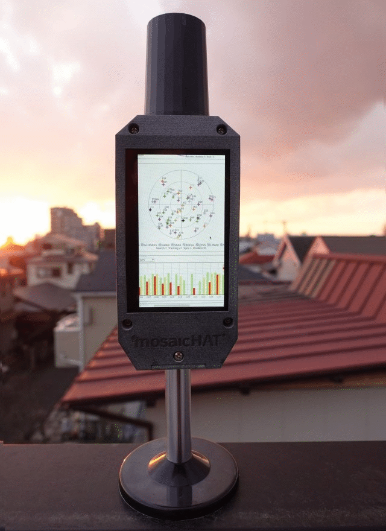
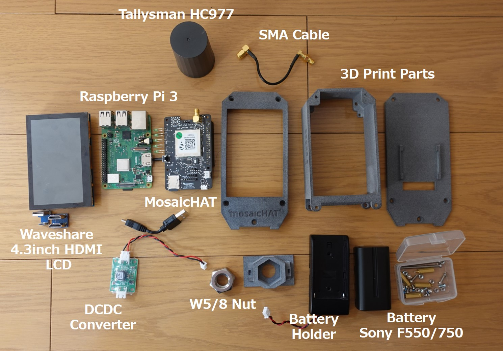
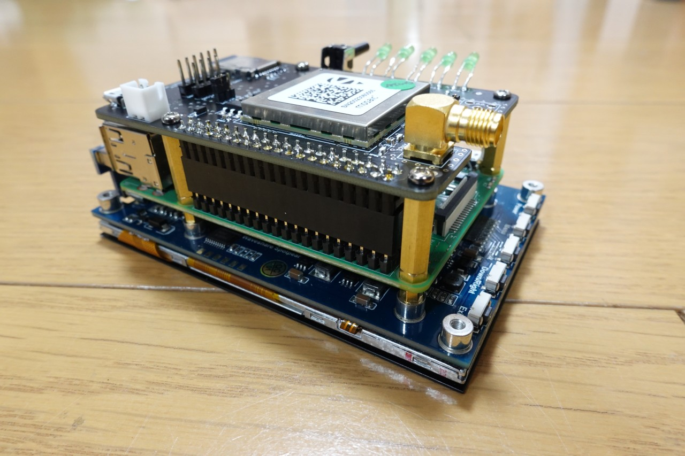
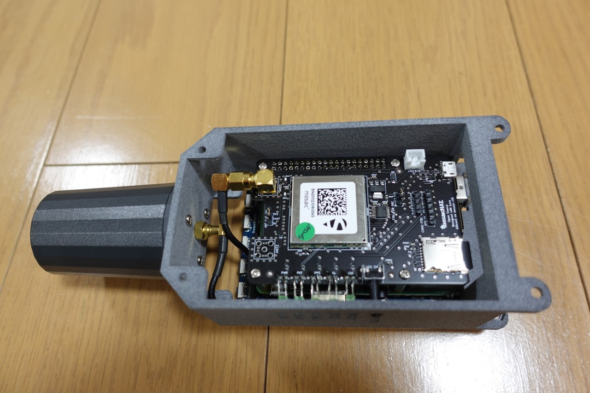
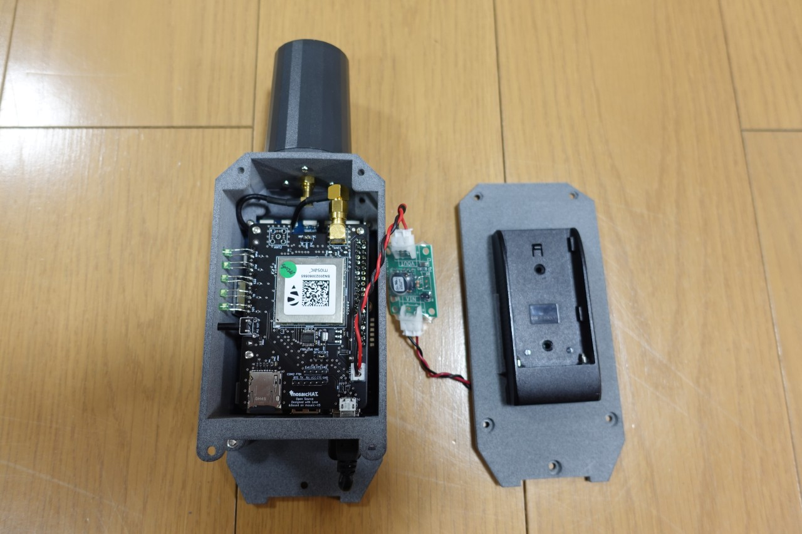
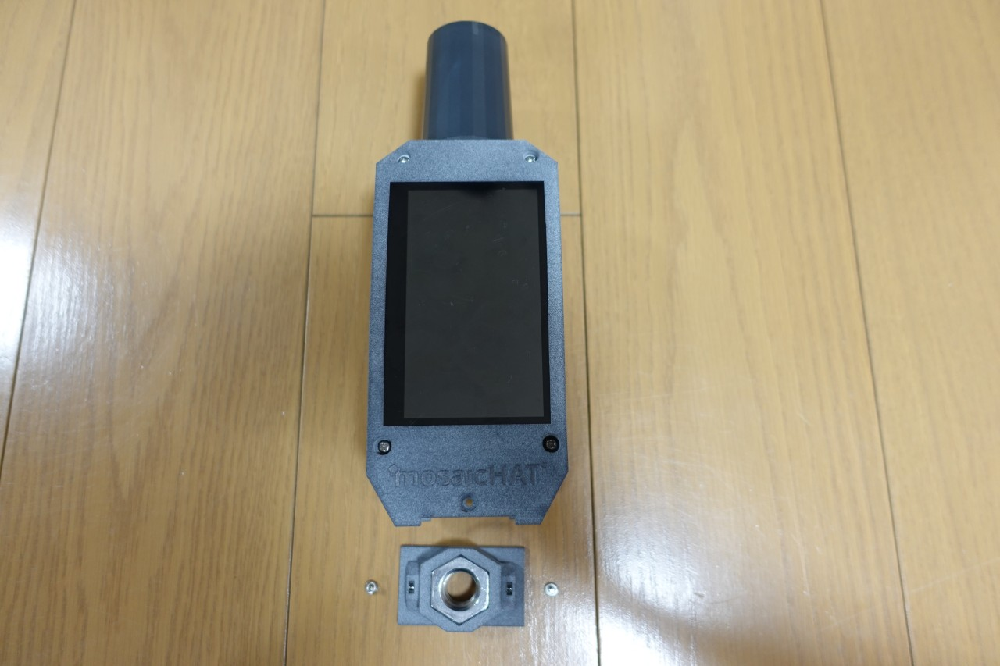

# mosaicHAT-Station
## Introduction
- [mosaicHAT](https://github.com/septentrio-gnss/mosaicHAT) + GNSS antenna + Raspberry Pi + Touch screen + Battery + Case
- We use [Septentrio's mosaic-X5](https://www.septentrio.com/en/products/gnss-receivers/rover-base-receivers/receivers-module/mosaic) GNSS module which is a **low-cost** and **survey-grade** GNSS receiver
- This project is inspired by [mosaicHAT](https://github.com/septentrio-gnss/mosaicHAT) and extends it further. Thanks to the wonderful project [mosaicHAT](https://github.com/septentrio-gnss/mosaicHAT)!
- License: [Creative Commons Attribution Share-Alike License](https://creativecommons.org/licenses/by-sa/4.0/). and [Open Source HW](https://www.oshwa.org/definition/)  
 

## Features
- mosaicHAT Station has a touch screen to display a web user interface of mosaic-X5 receiver. We can easily operate, monitor, and control the GNSS receiver.
- Compared to the original [mosaicHAT](https://github.com/septentrio-gnss/mosaicHAT), we added micro SD card and a log button, so you can easily store GNSS data as a GNSS reference or rover station.  
  [](https://www.youtube.com/watch?v=CmkE35LLup8)

## Board
- The design of the board is based on the original mosaicHAT.
- [KiCAD files](./board/KiCAD) and [PCB](./board/KiCAD/pcb)
- Micro SD card and log button have been added for data logging capability
- Bill of Materials (BOM) is [here](./board)                                 
  

## Case
- You can create using 3D printer (STL data is [here](./case))
  - I used 3D printing service (by [Shapeways](https://www.shapeways.com/shops/tarosuzuki)) 
- A 5/8 nut can be fixed on the case, which can be attached to a pole or antenna mount for GNSS surveying.  
 

## How to assemble
- Parts list is [here](./case)  
<p>

1. Mount the Raspberry Pi on the touch screen. Then mount the mosaicHAT on the Rasberry Pi using the M2.5 18mm spacers and screws.   
<p>

2. Fix the GNSS antenna using the M2.5 screws. Connect the SMA cable. Mount the touch display on the case using the M2.5 screws.   
<p>

3. Modify the battery holder to connect the DCDC converter to the battery. Fix the battery holder to the back plate. Then connect the power cable to the mosaicHAT. Fix the front plate using the M3 screws.  
<p>

4. Finally, fix the front and back plate using M3 50mm screws. Insert the W5/8 nut to bottom plate. Fix the bottom plate to the case.   
<p> 

## Setup
### Install **Raspberry Pi OS** on Raspberry Pi
- See [here](https://www.raspberrypi.org/software/)

### Setup Toouch Screen
- mosaicHAT-Station uses [Waveshare 4.3inch HDMI LCD(B)](https://www.waveshare.com/4.3inch-hdmi-lcd-b.htm). See the [wiki](https://www.waveshare.com/wiki/4.3inch_HDMI_LCD_(B)) for setup instructions.

### Start web user interface of mosaic-X5
- mosaicHAT-Station uses Raspberry PI kiosk mode with Chromium for the web user interface.
- Install chromium.
```
sudo apt-get update && apt-get upgrade -y
sudo apt-get install chromium x11-xserver-utils
```
- Edit `/etc/xdg/lxsession/LXDE/autostart` and add the following lines:
```
@xset s off
@xset -dpms
@xset s noblank
@chromium --noerrdialogs --kiosk --incognito 192.168.3.1
```

### Make Raspberry Pi file system read-only
- Let's turn off the Raspberry Pi at any time without risk of damaging the operating system files.
- Run `sudo raspi-config`
- Choose "performance options" and then "Overlay File System". Choose "Yes" to enable it, and then choose "Yes" again to make the boot filesystem read-only.